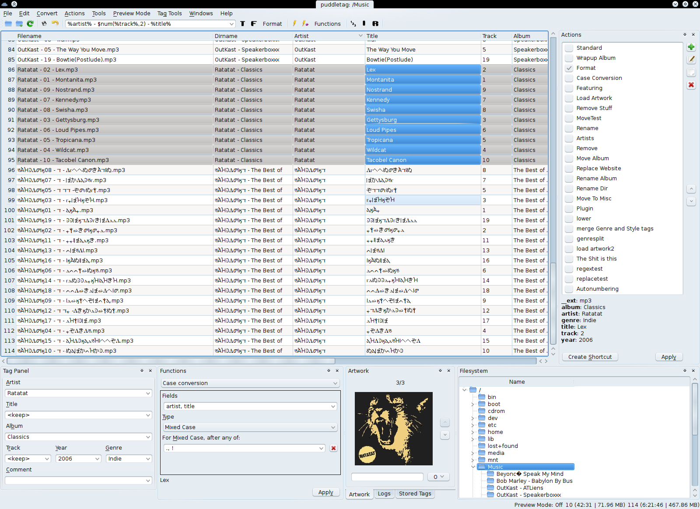

# puddletag



puddletag is an audio tag editor (primarily created) for GNU/Linux similar to the Windows program, Mp3tag. Unlike most taggers for GNU/Linux, it uses a spreadsheet-like layout so that all the tags you want to edit by hand are visible and easily editable.

The usual tag editor features are supported like extracting tag information from filenames, renaming files based on their tags by using patterns and basic tag editing.

Then there’re _Functions_, which can do things like replace text, trim it, do case conversions, etc. _Actions_ can automate repetitive tasks. Doing web lookups using Amazon (including cover art), Discogs (does cover art too!), FreeDB and MusicBrainz is also supported. There’s quite a bit more, but I’ve reached my comma quota.

Supported formats: ID3v1, ID3v2 (mp3), MP4 (mp4, m4a, etc.), VorbisComments (ogg, flac), Musepack (mpc), Monkey’s Audio (.ape) and WavPack (wv).


## Dependencies

puddletag uses several third-party modules to performs its tasks:

- [Python3](https://www.python.org/)
- [PyQt5](https://pypi.org/project/pyqt5/), for the GUI.
- [configobj](https://pypi.org/project/configobj/)
- [pyparsing](https://pypi.org/project/pyparsing/) , takes care of the parsing
- [Mutagen](https://pypi.org/project/mutagen/), used as the tagging lib
- [Chromaprint](http://acoustid.org/chromaprint) (recommended), for AcoustID support
- [unidecode](https://pypi.org/project/Unidecode/)


## How to install

### PyPI

Puddletag is available on [PyPI](https://pypi.org/project/puddletag/).

In addition to the full releases, every time we merge a PR or commit a change, we automatically release a new version on [TestPyPI](https://test.pypi.org/project/puddletag/), so if you want to try a brand new feature or a recent bugfix, you can give these pre-releases a try.

There are several tools to install puddletag via PyPI, for example [pip](https://packaging.python.org/en/latest/tutorials/installing-packages/#installing-to-the-user-site), [pipx](https://pypa.github.io/pipx/installation/), [pipenv](https://pipenv.pypa.io/en/latest/), and several others. Choose the one that suits best your workflow, but we strongly recommend you create an isolated, local (f.e. by using `pip install --local`) environment when installing third-party software.

### Distributions package

Here below is a list of the distributions and platforms where puddletag is available, and how to install it:

<details>
<summary><b>Debian</b></summary>

`apt install puddletag`

Contact: @sandrotosi
</details>

<details>
<summary><b>Gentoo</b></summary>

1. overlay: https://github.com/istitov/stuff/
1. add overlay: `sudo layman -a stuff`
1. install: `sudo emerge -av puddletag`

Contact: @DolphinStKom
</details>

<details>
<summary><b>Arch Linux</b></summary>

puddletag is currently part of the [AUR](https://aur.archlinux.org/packages/puddletag/):

```
git clone https://aur.archlinux.org/puddletag.git
cd puddletag
makepkg -si
```

</details>

<details>
<summary><b>Fedora</b></summary>

Available since Fedora 32.

`dnf install puddletag`
</details>

<details>
<summary><b>Brew/MacOS</b></summary>

_support needed, open an issue if interested in working on it_
</details>

### Source Code

If you seek the bleeding edge of puddletag, or wanting to contribute (we welcome all contributions!) you can install and/or run via source code.

First, you need to install the dependencies; this step is different depending on the distribution; on Debian you can run:

```
apt install python3 python3-mutagen python3-configobj python3-pyparsing python3-pyqt5 python3-pyqt5.qtsvg python3-unidecode
```

Then, clone the repo and run puddletag:

```sh
git clone 'https://github.com/puddletag/puddletag'
cd 'puddletag'
./puddletag
```

Alternatively you can use a [virtual environment](https://docs.python.org/3/library/venv.html) to install the dependencies, which only requires python and pip to be installed:
```sh
git clone 'https://github.com/puddletag/puddletag.git'
cd 'puddletag'
python3 -m 'venv' '.'
bin/pip3 install -r 'requirements.txt'
bin/python3 'puddletag'
```

## License

`puddletag` is licensed under the GPLv3, which you can find in its entirety at  [http://www.gnu.org/licenses/gpl-3.0.html](http://www.gnu.org/licenses/gpl-3.0.html)  
